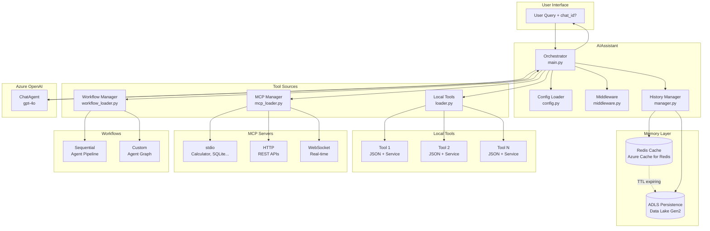

# MSFT Agent Framework

A general-purpose, extensible AI agent template using the [Microsoft Agent Framework](https://learn.microsoft.com/en-us/agent-framework/overview/agent-framework-overview) with dynamic tool loading, MCP support, and multi-agent workflows.

Build intelligent AI assistants that can reason, chain tool calls, orchestrate multi-agent pipelines, and solve complex multi-step problems.

## Architecture



## Features

- **Dynamic Tool Loading** — Drop JSON configs in `config/tools/` and matching services in `src/` for auto-discovery
- **MCP Support** — Connect to external MCP servers (stdio, HTTP, WebSocket) for extended capabilities
- **Multi-Agent Workflows** — Define sequential or custom agent pipelines for complex orchestration
- **Session Management** — Multi-turn conversations with Redis cache and ADLS persistence
- **TOML Configuration** — Professional configuration via `config/agent.toml` or `pyproject.toml`
- **Azure OpenAI Integration** — Built-in support for Azure OpenAI with DefaultAzureCredential
- **Agentic Reasoning** — Multi-step reasoning with automatic tool chaining
- **Middleware Support** — Extensible middleware for logging, security, and transformations
- **Clean Architecture** — Separation of concerns with modular services

## Quick Start

### 1. Clone and Install

```bash
git clone https://github.com/your-org/MSFT-AGENT-FRAMEWORK.git
cd MSFT-AGENT-FRAMEWORK
pip install -e .
```

### 2. Configure Azure OpenAI

Edit `config/agent.toml`:

```toml
[agent.azure_openai]
endpoint = "https://your-resource.openai.azure.com/"
deployment = "gpt-4o"
```

Or set environment variables:

```bash
export AZURE_OPENAI_ENDPOINT="https://your-resource.openai.azure.com/"
export AZURE_OPENAI_DEPLOYMENT="gpt-4o"
```

### 3. Run the Agent

```python
import asyncio
from src.orchestrator.main import AIAssistant

async def main():
    # Using async context manager (recommended for MCP support)
    async with AIAssistant() as assistant:
        result = await assistant.process_question("Hello! What can you help me with?")
        print(result["response"])

asyncio.run(main())
```

## Project Structure

```
MSFT-AGENT-FRAMEWORK/
├── config/
│   ├── agent.toml              # Main configuration file
│   ├── system_prompt.txt       # Agent's system prompt
│   └── tools/                  # Tool JSON definitions
│       └── example_tool.json
├── src/
│   ├── orchestrator/           # Core agent framework
│   │   ├── main.py            # AIAssistant class
│   │   ├── config.py          # TOML config loader
│   │   ├── loader.py          # Dynamic tool loader
│   │   ├── mcp_loader.py      # MCP server manager
│   │   ├── workflow_loader.py # Workflow manager
│   │   └── middleware.py      # Request/response middleware
│   └── example_tool/           # Example tool implementation
│       ├── __init__.py
│       └── service.py
├── tests/
│   └── test_integration.py
├── deployment/
│   └── Dockerfile
├── docs/
│   └── architecture.md         # Detailed architecture diagram
└── pyproject.toml
```

## Adding New Tools

Adding a new tool requires just 2-3 simple steps:

### Step 1: Create Tool Config

Create `config/tools/<tool_name>.json`:

```json
{
  "type": "function",
  "function": {
    "name": "weather",
    "description": "Get current weather for a location",
    "parameters": {
      "type": "object",
      "properties": {
        "location": {
          "type": "string",
          "description": "City name or coordinates"
        }
      },
      "required": ["location"]
    }
  }
}
```

### Step 2: Create Service

Create `src/<tool_name>/service.py`:

```python
from typing import Any, Dict

class WeatherService:
    """Service for weather lookups."""
    
    def __init__(self):
        # Initialize API clients, connections, etc.
        pass
    
    def run(self, tool_call: Dict[str, Any]) -> str:
        """
        Execute the tool logic.
        
        Args:
            tool_call: Parameters from the LLM matching your JSON config
        
        Returns:
            str: Result to return to the LLM
        """
        location = tool_call.get("location", "")
        
        # Your logic here
        weather_data = self._fetch_weather(location)
        
        return f"Weather in {location}: {weather_data}"
    
    def _fetch_weather(self, location: str) -> str:
        # Call your weather API
        return "Sunny, 72°F"
```

### Step 3 (Optional): Add Tool Config

Add tool-specific settings in `config/agent.toml`:

```toml
[agent.tools.weather]
api_key = "your-api-key"
units = "fahrenheit"
```

Access in your service:

```python
from src.orchestrator.config import get_config

config = get_config()
tool_config = config.get_tool_config("weather")
api_key = tool_config.get("api_key")
```

## Naming Convention

The framework uses a strict naming convention for auto-discovery:

| Config File | Service File | Service Class |
|-------------|--------------|---------------|
| `config/tools/weather.json` | `src/weather/service.py` | `WeatherService` |
| `config/tools/database.json` | `src/database/service.py` | `DatabaseService` |
| `config/tools/my_api.json` | `src/my_api/service.py` | `MyApiService` |

## Configuration

### TOML Configuration (`config/agent.toml`)

```toml
[agent]
system_prompt = "config/system_prompt.txt"
log_level = "INFO"

[agent.azure_openai]
endpoint = "https://your-resource.openai.azure.com/"
deployment = "gpt-4o"
api_version = "2024-10-01-preview"

[agent.tools]
config_dir = "config/tools"

[agent.tools.my_tool]
api_key = "secret"
timeout = 30
```

### Environment Variable Overrides

Environment variables take precedence over TOML:

| Variable | Description |
|----------|-------------|
| `AZURE_OPENAI_ENDPOINT` | Azure OpenAI endpoint URL |
| `AZURE_OPENAI_DEPLOYMENT` | Model deployment name |
| `AZURE_OPENAI_API_VERSION` | API version (optional) |

## MCP (Model Context Protocol) Support

Connect to external MCP servers to extend your agent's capabilities. The framework supports three MCP transport types.

### MCP Configuration

Add MCP servers in `config/agent.toml`:

```toml
# Stdio MCP - runs as local subprocess
[[agent.mcp]]
name = "calculator"
type = "stdio"
enabled = true
command = "uvx"
args = ["mcp-server-calculator"]

# HTTP MCP - connects to HTTP/SSE endpoint
[[agent.mcp]]
name = "my-api"
type = "http"
enabled = true
url = "https://api.example.com/mcp"
headers = { Authorization = "Bearer your-token" }

# WebSocket MCP - real-time connection
[[agent.mcp]]
name = "realtime"
type = "websocket"
enabled = true
url = "wss://api.example.com/mcp"
```

### MCP Types

| Type | Use Case | Required Fields |
|------|----------|-----------------|
| `stdio` | Local CLI tools (uvx, npx) | `command`, `args` |
| `http` | REST APIs with SSE | `url`, optional `headers` |
| `websocket` | Real-time connections | `url` |

### Windows Note

On Windows, `uvx` may not be directly available in PATH. Use `python -m uv tool run` instead:

```toml
[[agent.mcp]]
name = "calculator"
type = "stdio"
command = "python"
args = ["-m", "uv", "tool", "run", "mcp-server-calculator"]
```

### Popular MCP Servers

```toml
# Calculator
[[agent.mcp]]
name = "calculator"
type = "stdio"
command = "uvx"
args = ["mcp-server-calculator"]

# Filesystem access
[[agent.mcp]]
name = "filesystem"
type = "stdio"
command = "uvx"
args = ["mcp-server-filesystem", "/path/to/allowed/dir"]

# GitHub
[[agent.mcp]]
name = "github"
type = "stdio"
command = "npx"
args = ["@modelcontextprotocol/server-github"]
env = { GITHUB_TOKEN = "your-token" }

# SQLite database
[[agent.mcp]]
name = "sqlite"
type = "stdio"
command = "uvx"
args = ["mcp-server-sqlite", "--db-path", "./data.db"]
```

### Using MCP with the Assistant

MCP servers are automatically loaded during initialization:

```python
async with AIAssistant() as assistant:
    # MCP tools are available alongside local tools
    result = await assistant.process_question("What is 15 * 23 + 45?")
    print(result["response"])
```

## Workflows (Multi-Agent Pipelines)

Create sophisticated multi-agent pipelines where specialized agents work together sequentially or in custom graph patterns.

### Why Workflows?

- **Specialization** — Each agent can focus on one task (research, write, review)
- **Quality** — Multi-pass processing improves output quality
- **Control** — Explicit flow vs. dynamic LLM-driven decisions
- **Composability** — Workflows can be used as building blocks

### Workflow Configuration

Add workflows in `config/agent.toml`:

```toml
# Sequential Workflow - agents execute in order
[[agent.workflows]]
name = "content-pipeline"
type = "sequential"
enabled = true

[[agent.workflows.agents]]
name = "Researcher"
instructions = "Research the given topic and provide key facts."

[[agent.workflows.agents]]
name = "Writer"
instructions = "Write engaging content based on the research."

[[agent.workflows.agents]]
name = "Reviewer"
instructions = "Review and polish the content for clarity."
```

### Custom Workflow (Graph-based)

```toml
[[agent.workflows]]
name = "support-triage"
type = "custom"
enabled = true
start = "Triage"

[[agent.workflows.agents]]
name = "Triage"
instructions = "Analyze the issue and determine next steps."

[[agent.workflows.agents]]
name = "TechSupport"
instructions = "Provide technical solutions."

[[agent.workflows.agents]]
name = "Escalation"
instructions = "Handle complex escalated issues."

[[agent.workflows.edges]]
from = "Triage"
to = "TechSupport"

[[agent.workflows.edges]]
from = "TechSupport"
to = "Escalation"
```

### Using Workflows

```python
async with AIAssistant() as assistant:
    # List available workflows
    print(assistant.list_workflows())  # ['content-pipeline', 'support-triage']
    
    # Run a workflow
    result = await assistant.run_workflow(
        "content-pipeline",
        "Write an article about AI trends in 2025"
    )
    
    print(f"Final output by {result['author']}:")
    print(result["response"])
```

### Streaming Workflow Output

```python
async with AIAssistant() as assistant:
    # Stream workflow execution
    stream = await assistant.run_workflow(
        "content-pipeline",
        "Write about quantum computing",
        stream=True
    )
    
    async for update in stream:
        if update["author"]:
            print(f"\n[{update['author']}]: ", end="")
        if update["text"]:
            print(update["text"], end="", flush=True)
```

### Workflow Types

| Type | Description | Use Case |
|------|-------------|----------|
| `sequential` | Agents execute in defined order | Content pipelines, review chains |
| `custom` | User-defined graph with edges | Conditional routing, complex flows |

## Session Management

The framework supports multi-turn conversations with optional Redis caching and ADLS persistence.

### Basic Usage with Sessions

```python
async with AIAssistant() as assistant:
    # First message - new session (auto-generated chat_id)
    result1 = await assistant.process_question("Hello, my name is Alice")
    chat_id = result1["chat_id"]  # Save this for continuity
    
    # Continue the same session
    result2 = await assistant.process_question(
        "What's my name?",
        chat_id=chat_id
    )
    # Response: "Your name is Alice"
    
    # List all sessions
    chats = await assistant.list_chats()
    
    # Delete a session
    await assistant.delete_chat(chat_id)
```

### Session Configuration

Configure caching and persistence in `config/agent.toml`:

```toml
# Redis Cache (Azure Cache for Redis with AAD auth)
[agent.memory.cache]
enabled = true
host = "your-redis.redis.cache.windows.net"
port = 6380
ssl = true
ttl = 3600  # 1 hour
prefix = "chat:"

# ADLS Persistence (Azure Data Lake Storage Gen2)
[agent.memory.persistence]
enabled = true
account_name = "yourstorageaccount"
container = "chat-history"
folder = "threads"
schedule = "ttl+300"  # Persist 5 min before cache TTL expires
```

### Session Flow

| Scenario | Behavior |
|----------|----------|
| No `chat_id` provided | Generate new UUID, create new thread |
| `chat_id` in cache | Restore from Redis |
| `chat_id` not in cache, in ADLS | Load from ADLS, cache it |
| `chat_id` not found anywhere | Create new thread with provided ID |

### Authentication

All Azure services use `DefaultAzureCredential` - no API keys required:
- **Redis**: Uses AAD token authentication
- **ADLS**: Uses managed identity or logged-in Azure CLI user

## System Prompt

Customize `config/system_prompt.txt` to define your agent's behavior:

```text
You are an intelligent AI assistant that helps users with...

YOUR CAPABILITIES:
- Use tools to gather information
- Chain multiple tool calls for complex questions
- Provide clear, structured responses

AVAILABLE TOOLS:
...
```

## Middleware

Add custom middleware in `src/orchestrator/middleware.py`:

```python
async def my_middleware(context, next):
    # Before tool execution
    print(f"Calling: {context.function.name}")
    
    await next(context)
    
    # After tool execution
    print(f"Result: {context.result}")
```

Register in `main.py`:

```python
self.agent = ChatAgent(
    chat_client=self.chat_client,
    instructions=self.system_prompt,
    tools=self.tools,
    middleware=[function_call_middleware, my_middleware],
)
```

## Docker Deployment

```bash
cd deployment
docker build -t msft-agent .
docker run -e AZURE_OPENAI_ENDPOINT=... -e AZURE_OPENAI_DEPLOYMENT=... msft-agent
```

## Testing

```bash
pip install -e ".[dev]"
pytest tests/ -v
```

## Requirements

- Python 3.10+
- Azure OpenAI resource with deployed model
- Azure identity configured (DefaultAzureCredential)

## License

MIT
