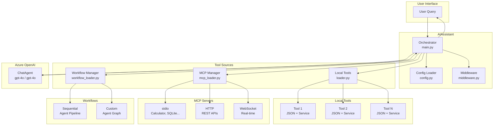
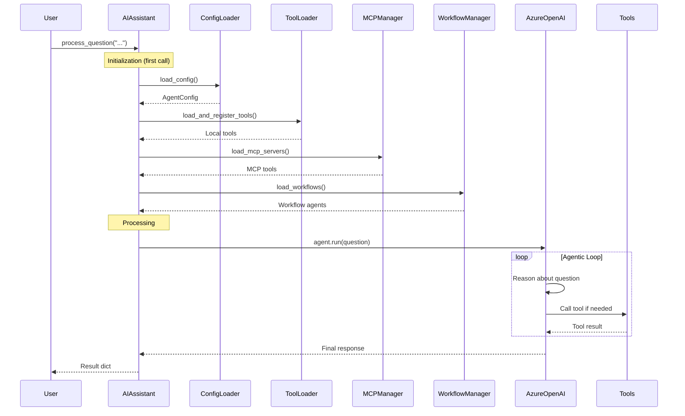
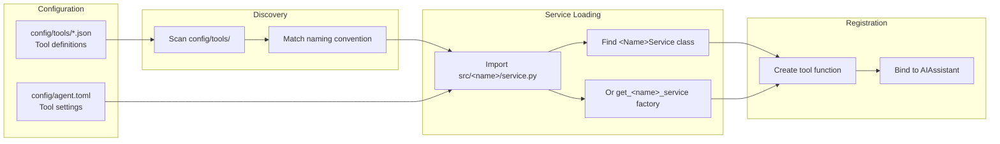
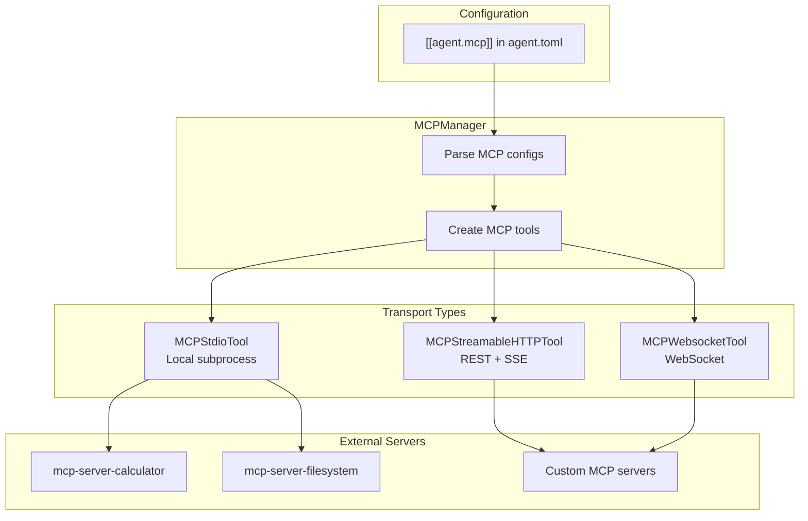
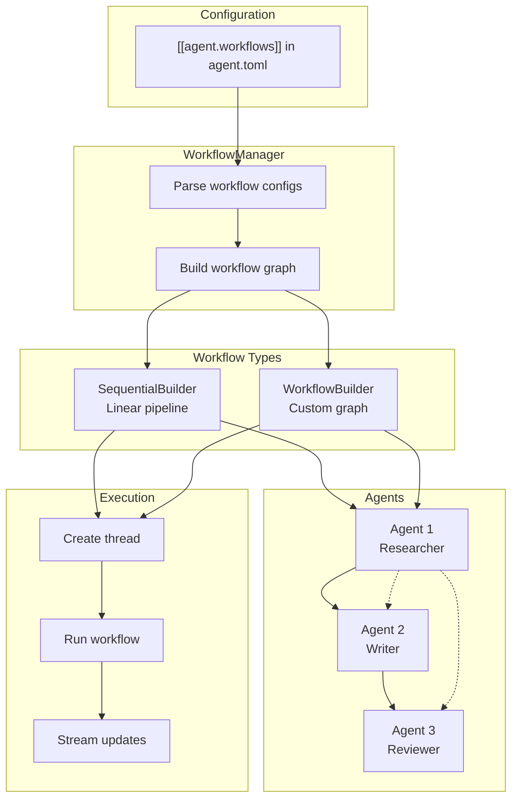
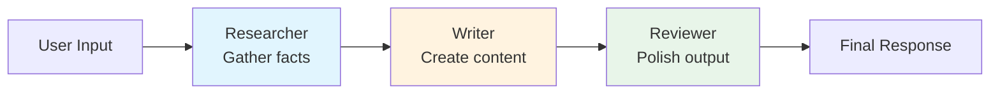
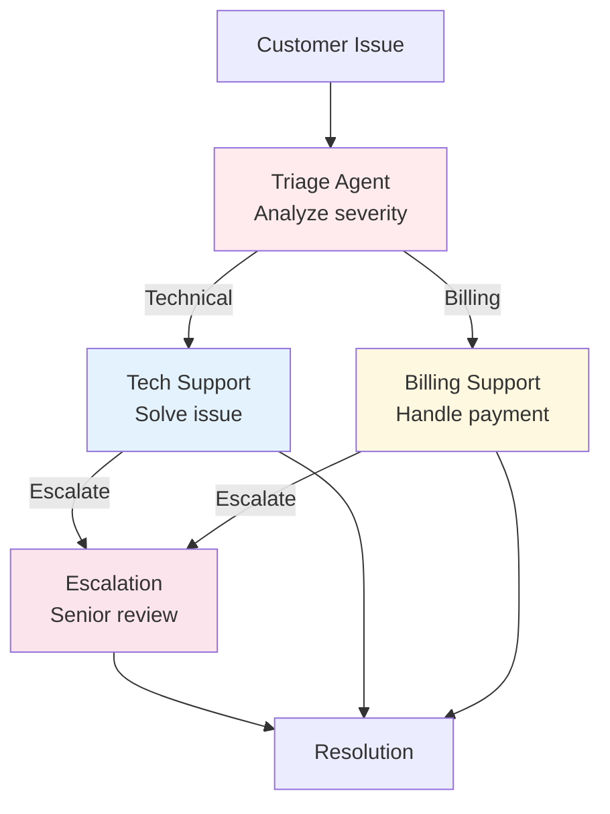

# MSFT Agent Framework Architecture

This document provides detailed architectural diagrams for the Microsoft Agent Framework template.

## High-Level Architecture



## Request Flow



## Tool Loading Architecture



## MCP Integration



## Workflow Architecture



## Sequential Workflow Example



## Custom Workflow Example (Support Triage)



## Configuration Hierarchy

```mermaid
graph TB
    subgraph "Priority (highest to lowest)"
        ENV[Environment Variables<br/>AZURE_OPENAI_*]
        TOML[config/agent.toml<br/>Main config]
        PYPROJ[pyproject.toml<br/>[tool.agent] section]
        DEFAULTS[Built-in defaults]
    end
    
    ENV --> MERGED[Merged Configuration]
    TOML --> MERGED
    PYPROJ --> MERGED
    DEFAULTS --> MERGED
    MERGED --> APP[AgentConfig object]
```

## Component Responsibilities

| Component | File | Responsibility |
|-----------|------|----------------|
| **AIAssistant** | `main.py` | Main orchestrator, question processing, lifecycle management |
| **AgentConfig** | `config.py` | TOML loading, validation, environment overrides |
| **ToolLoader** | `loader.py` | Dynamic tool discovery, service instantiation |
| **MCPManager** | `mcp_loader.py` | MCP server connections (stdio/http/ws) |
| **WorkflowManager** | `workflow_loader.py` | Multi-agent workflow creation and execution |
| **Middleware** | `middleware.py` | Request/response interception, logging |

## Data Flow Summary

1. **User Query** → AIAssistant receives question
2. **Configuration** → Load TOML, environment vars
3. **Tool Loading** → Discover and instantiate all tools
4. **MCP Loading** → Connect to external MCP servers
5. **Workflow Loading** → Build multi-agent pipelines
6. **Agent Creation** → Initialize ChatAgent with tools
7. **Processing** → LLM reasons and calls tools as needed
8. **Response** → Final answer returned to user
