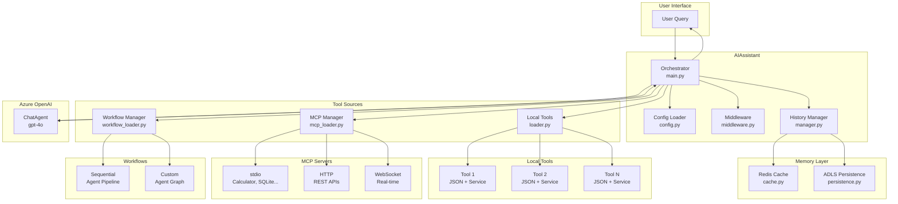
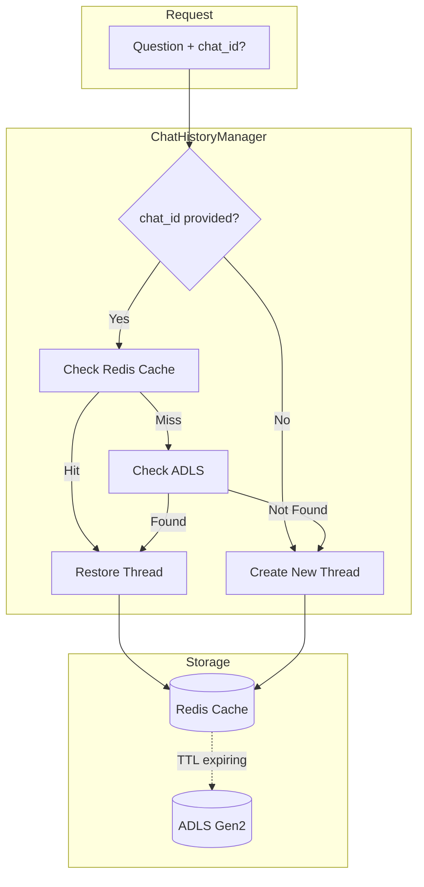

# MSFT Agent Framework Architecture

This document provides detailed architectural diagrams for the Microsoft Agent Framework template.

## High-Level Architecture

## Request Flow

## Tool Loading Architecture

## MCP Integration

## Workflow Architecture

## Sequential Workflow Example

## Custom Workflow Example (Support Triage)

## Component Responsibilities

| Component | File | Responsibility |
|-----------|------|----------------|
| **AIAssistant** | `main.py` | Main orchestrator, question processing, lifecycle management |
| **AgentConfig** | `config.py` | TOML loading, validation, environment overrides |
| **ToolLoader** | `loader.py` | Dynamic tool discovery, service instantiation |
| **MCPManager** | `mcp_loader.py` | MCP server connections (stdio/http/ws) |
| **WorkflowManager** | `workflow_loader.py` | Multi-agent workflow creation and execution |
| **ChatHistoryManager** | `memory/manager.py` | Session management, cache + persistence orchestration |
| **RedisCache** | `memory/cache.py` | Azure Cache for Redis with AAD auth |
| **ADLSPersistence** | `memory/persistence.py` | ADLS Gen2 for long-term chat storage |
| **Middleware** | `middleware.py` | Request/response interception, logging |

## Chat History & Session Management

The framework supports multi-turn conversations with session persistence.

### Session Flow Edge Cases

| chat_id | Cache | ADLS | Action |
|---------|-------|------|--------|
| None | - | - | Generate new UUID, create thread |
| Provided | Hit | - | Restore from cache |
| Provided | Miss | Found | Load from ADLS → cache |
| Provided | Miss | Not Found | Create new with provided ID |

### Merge Logic

When persisting to ADLS, the manager:
1. Loads existing ADLS data (if any)
2. Merges with cache data (new messages win)
3. Preserves original `_created_at` timestamp
4. Increments `_merge_count` for auditing

## Data Flow Summary

1. **User Query** → AIAssistant receives question + optional `chat_id`
2. **Session Lookup** → ChatHistoryManager checks cache → ADLS → creates new
3. **Configuration** → Load TOML, environment vars
4. **Tool Loading** → Discover and instantiate all tools
5. **MCP Loading** → Connect to external MCP servers
6. **Workflow Loading** → Build multi-agent pipelines
7. **Agent Creation** → Initialize ChatAgent with tools
8. **Processing** → LLM reasons and calls tools as needed
9. **Session Save** → Update cache, persist to ADLS before TTL
10. **Response** → Final answer + `chat_id` returned to user

